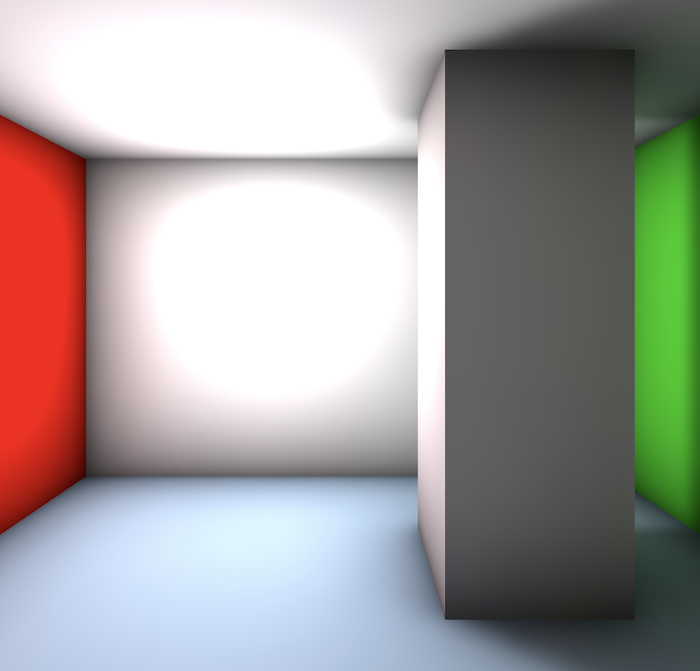

# lovr-sample-lightmapping
A code sample for LÖVR that calculates a lightmap, while maintaining app
responsiveness. The lightmap includes direct light and shadow, indirect bounce
lighting, and ambient occlusion. The calculation is programmed in Lua, and can
be run in a LÖVR project without additional external dependencies.

## Data
The project uses a simple, limited data representation. A type called `GeoFace`
is implemented in `geoface.lua`, alongside a hand-written sample scene. A
`GeoFace` defines colored rectangles.

## Threading
To maintain responsiveness, the lightmap is calculated using worker threads. A
scheduler thread is implemented in `scheduler.lua`, which manages the whole
process, and acts as an intermediary between the main thread and the worker
threads.

The worker threads are implemented in `worker.lua`. They wait for jobs to come
in on a queue, and invoke tasks implemented in the `tasks/` folder accordingly.

## Tasks
There are three tasks used to implement different lightmap passes: direct,
bounce, and ambient occlusion.

### Direct
The direct lighting pass calculates light contribution from a point light
source, attenuating based off of distance and facing, with shadows based on
occluding geometry. A configurable quality setting allows multiple samples to be
taken per sample from slightly offset positions, to anti-alias the shadow.

### Bounce
Bounce lighting allows surfaces to receive light reflected off other surfaces.
The bounced lighting accounts for surface color. Rays are cast randomly, and a
denoiser cleans the image at the end.

### Ambient Occlusion
An ambient occlusion pass paints artificial darkness into corners and crevices,
enhancing the sense of definition. Rays are cast out a limited distance, and the
surface is darkened based on how many rays hit another surface, and how close
those hits are to the surface.

## Bicubic Filtering
Normal bilinear texture filtering produces a noticeable blocky pattern that
stands out for the large texel sizes of a lightmap. A shader-based bicubic
texture sampler smooths out shadow edges. Combined with the anti-aliasing from
the direct lighting pass, shadows have minimal artifacting.
